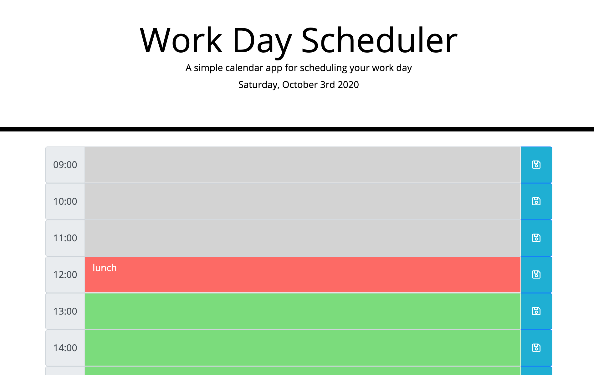

# one_day_planner

A simple calendar application that allows a user to save events for each hour of the day. 

### How  it look?



### Where it deployed?

[One day planner](https://myau5x.github.io/one_day_planner/)


### How it work?

```
GIVEN I am using a daily planner to create a schedule
WHEN I open the planner
THEN the current day is displayed at the top of the calendar
WHEN I scroll down
THEN I am presented with time blocks for standard business hours
WHEN I view the time blocks for that day
THEN each time block is color-coded to indicate whether it is in the past, present, or future
WHEN I click into a time block
THEN I can enter an event
WHEN I click the save button for that time block
THEN the text for that event is saved in local storage
WHEN I refresh the page
THEN the saved events persist
```

### Files
- `index.html` &ndash; html page
- `ctyle.css` &ndash; styles for html
- `script.js` &ndash; script that works with planner

### What did I use?

I used Jquery to make dinamic html.
I used Moment.js to work with date and time.
I used Bootstrap and FontAwesome to design my page.

### Licence
[MIT License](https://github.com/Myau5x/one_day_planner/blob/master/LICENSE)